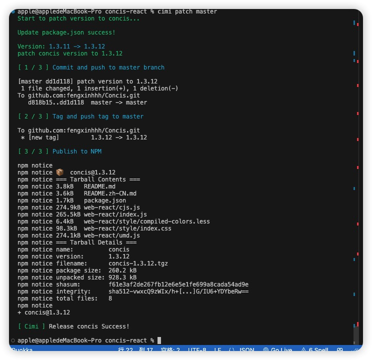

[](https://www.npmjs.com/package/cimi)
[](https://www.npmjs.com/package/cimi)

# Cimi

一款全自动npm发包工具，一行命令帮助你git replase、创建git tag、发布npm包。

Cimi自动生成新版本号，自动生成commit message，创建tag，push到github，最后发布到npm中，整个过程只需要一行命令，解放你的双手！

## 使用示例



## Cimi有什么优势？

当我们在开发组件库或者其他开源工具包时，我们发一个新的 NPM 包可能需要这些工作：

* 手动修改`package.json`中的`version`.
* `git add .`、`git commit -m "xxxx"`生成一个提交.
* `git push origin master` 推送到远端.
* 在github中打一个新`tag`.
* `npm publish`将代码提交到NPM.

听起来是不是很麻烦？而有了`cimi`，你只需要一行简单的代码:

`cimi patch main`

就可以完成上面所有事情。

## Cimi修改版本规则

`Cimi`共有六种规则，来进行发包，其实也就是确定版本号。

* `cimi patch` 更新一个小版本，如1.1.0 -> 1.1.1，如bug修复;
* `cimi minor` 更新一个中版本，如1.1.0 -> 1.2.0，如新增功能;
* `cimi major` 更新一个大版本，如1.1.0 -> 2.1.0，如重构架构;
* `cimi beta` 将当前版本转为beta版本，如1.1.0 -> 1.1.0-beta，如生产前测试;
* `cimi upgradeBeta` 将当前beta版本升级一次beta号，如1.1.0-beta -> 1.1.0-beta2，如二次测试;
<!-- * `cimi patchBeta` 更新一个小的测试版本，如1.1.0 -> 1.1.1-beta，如bug修复;
* `cimi minor` 更新一个中的测试版本，如1.1.0 -> 1.2.0-beta，如新增功能;
* `cimi major` 更新一个大的测试版本版本，如1.1.0 -> 2.1.0-beta，如重构架构; -->

而分支默认为`master`，如果主分支为其他分支，应这样使用:

`cimi patch main`

`cimi patch dev`

当然，也可以通过`cimi manual`来触发对话模式，允许你手动输入更改版本。

类似这样的：


该场景适用于频繁更改`patch`或`patch-beta`版本号时，当然，更开放的交互更将让你有掌控感，不是吗？[偷笑]~

## 使用

```bash
# 全局安装cimi
npm i cimi -g
# 本地安装cimi
npm i cimi -D
```

以下是`cimi -h`的输出：

```
Usage: cimi [options]

A fully automatic NPM package tool, one line command to help you "git replase, create git tag, release NPM package"

Options:
  -v, --version  output the version number
  -m,manual      manual select your new package version
  patch          patch your new npm package
  minor          minor your new npm package
  major          major your new npm package
  beta           beta your new npm package
  upgradeBeta    upgrade your npm package new version
  -h, --help     display help for command

  Tip:

    You should run this script in the root directory of you project or run by npm scripts.

  Examples:

    $ cimi manual [branch] (default: master)
    $ cimi patch [branch] (default: master)
    $ cimi minor [branch] (default: master)
    $ cimi major [branch] (default: master)
    $ cimi beta [branch] (default: master)
    $ cimi upgradeBeta [branch] (default: master)

```

## LICENSE

[MIT](./LICENSE) © fengxin
